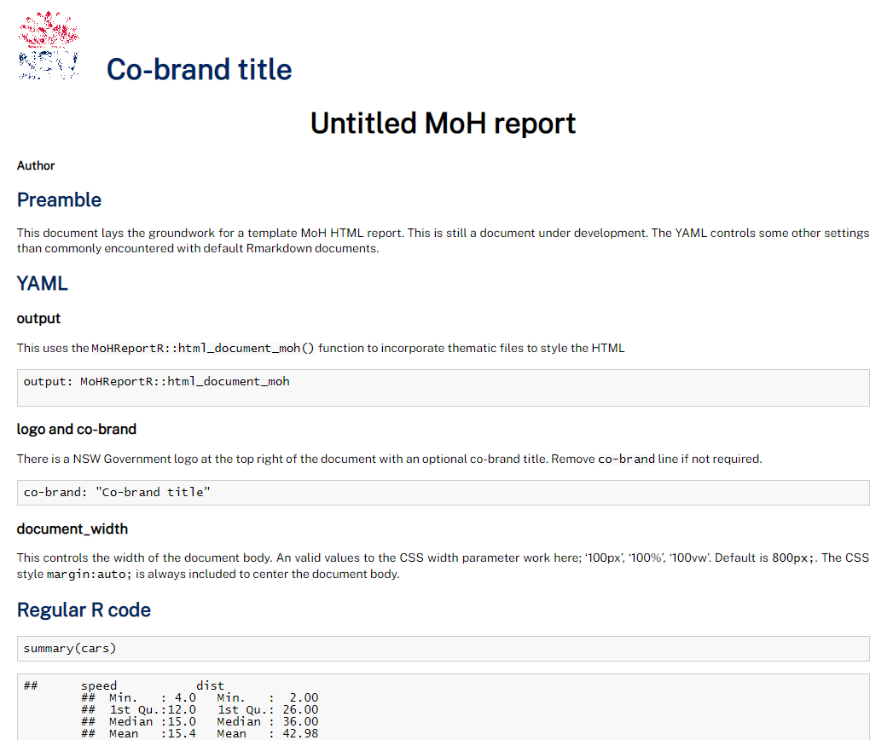

<!-- README.md is generated from README.Rmd. Please edit that file -->

```{r, include = FALSE}
knitr::opts_chunk$set(
  collapse = TRUE,
  comment = "#>",
  fig.path = "man/figures/README-",
  out.width = "100%"
)
```

# MoHReportR

<!-- badges: start -->
<!-- badges: end -->

The goal of MoHReportR is to provide easy to use templates (colours, themes, Rmarkdown)
for MoH related work using R.

## Installation

<!--You can install the released version of MoHReportR from [CRAN](https://CRAN.R-project.org) with:

``` r
install.packages("MoHReportR")
```
-->

You can install the development version from [GitHub](https://github.com/) with:

``` r
# install.packages("devtools")
devtools::install_github("Shaunson26/MoHReportR")
```

```{r}
library(MoHReportR)
```

## MoH colours

`moh_colours` is a function to return NSW government branding colours.

```{r}
# show colours and names
moh_colours(show_colours = T)

# Return all colours
moh_colours()

# Return first 4 colours
moh_colours(1:4)

# Return colours by name (see show_colours)
moh_colours(c('darkBlue', 'red')) 
```

`scale_fill_moh` and `scale_colour_moh` can be used with `ggplot2`.

```{r}
library(ggplot2)

ggplot(
  data.frame(
    names = LETTERS[1:10],
    vals = rep(1,10)),
  aes(x = names, y = vals, fill = names)) +
  geom_col() +
  scale_fill_moh() +
  theme_void()

ggplot(
  data.frame(
    names = LETTERS[1:10],
    vals = rep(1,10)),
  aes(x = names, y = vals, colour = names)) +
  geom_col(size = 3, fill = 'white') +
  scale_colour_moh() +
  theme_void()
```

## Functions

### Age grouping

```{r}
group_ages(ages = 1:100, by=5, max_age=95)
group_ages(ages = 1:100, by=10, max_age=50)
```

## RMarkdown templates

`MoHReportR` provides an R markdown template that uses the NSW Government branding
styles (https://www.nsw.gov.au/branding). This includes the Montserrat font and a
corporate logo.

After installation, you will be able to select MoH templates from the file menu.

```
File > New File > R Markdown > From Template
```

This will open a R Markdown template from the MoHReportR package. Knit this document
to see the template output.



