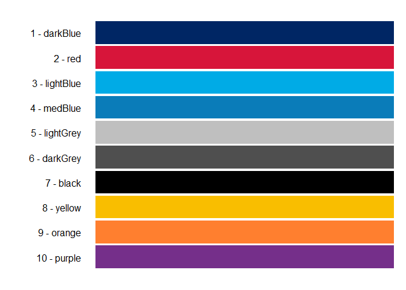
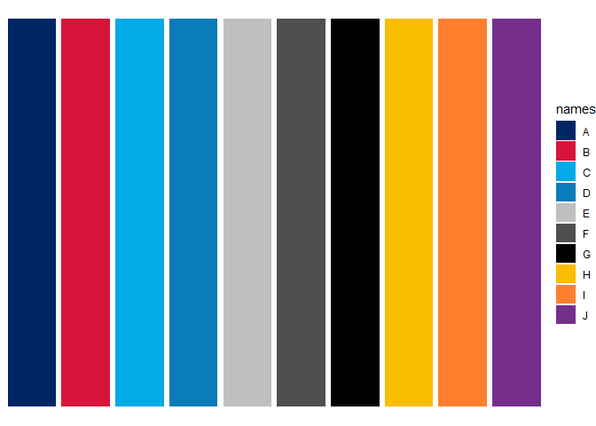
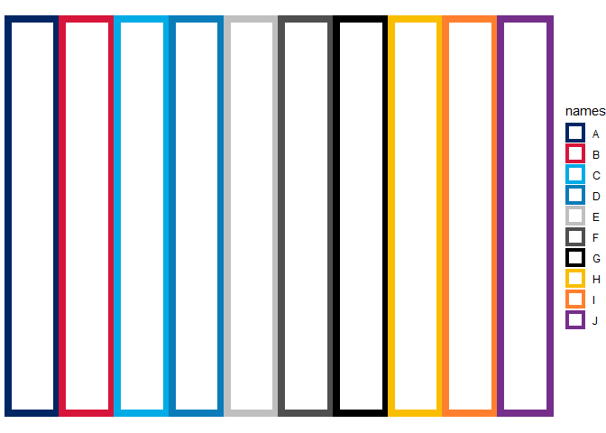

<!-- README.md is generated from README.Rmd. Please edit that file -->

# MoHReportR

<!-- badges: start -->
<!-- badges: end -->

The goal of MoHReportR is to provide easy to use templates (colours,
themes, Rmarkdown) for MoH related work using R.

## Installation

<!--You can install the released version of MoHReportR from [CRAN](https://CRAN.R-project.org) with:

``` r
install.packages("MoHReportR")
```
-->

You can install the development version from
[GitHub](https://github.com/) with:

``` r
# install.packages("devtools")
devtools::install_github("Shaunson26/MoHReportR")
```

``` r
library(MoHReportR)
```

## MoH colours

`moh_colours` is a function to return NSW government branding colours.

``` r
# show colours and names
moh_colours(show_colours = T)
```



``` r
# Return all colours
moh_colours()
#>  [1] "#002664" "#D7153A" "#00ABE6" "#0A7CB9" "#BFBFBF" "#4F4F4F" "#000000"
#>  [8] "#F9BE00" "#FF7F2F" "#752F8A"

# Return first 4 colours
moh_colours(1:4)
#> [1] "#002664" "#D7153A" "#00ABE6" "#0A7CB9"

# Return colours by name (see show_colours)
moh_colours(c('darkBlue', 'red')) 
#> [1] "#002664" "#D7153A"
```

`scale_fill_moh` and `scale_colour_moh` can be used with `ggplot2`.

``` r
library(ggplot2)

ggplot(
  data.frame(
    names = LETTERS[1:10],
    vals = rep(1,10)),
  aes(x = names, y = vals, fill = names)) +
  geom_col() +
  scale_fill_moh() +
  theme_void()
```



``` r
ggplot(
  data.frame(
    names = LETTERS[1:10],
    vals = rep(1,10)),
  aes(x = names, y = vals, colour = names)) +
  geom_col(size = 3, fill = 'white') +
  scale_colour_moh() +
  theme_void()
```



## Functions

### Age grouping

``` r
group_ages(ages = 1:100, by=5, max_age=95)
#>   [1] 0-4   0-4   0-4   0-4   5-9   5-9   5-9   5-9   5-9   10-14 10-14 10-14
#>  [13] 10-14 10-14 15-19 15-19 15-19 15-19 15-19 20-24 20-24 20-24 20-24 20-24
#>  [25] 25-29 25-29 25-29 25-29 25-29 30-34 30-34 30-34 30-34 30-34 35-39 35-39
#>  [37] 35-39 35-39 35-39 40-44 40-44 40-44 40-44 40-44 45-49 45-49 45-49 45-49
#>  [49] 45-49 50-54 50-54 50-54 50-54 50-54 55-59 55-59 55-59 55-59 55-59 60-64
#>  [61] 60-64 60-64 60-64 60-64 65-69 65-69 65-69 65-69 65-69 70-74 70-74 70-74
#>  [73] 70-74 70-74 75-79 75-79 75-79 75-79 75-79 80-84 80-84 80-84 80-84 80-84
#>  [85] 85-89 85-89 85-89 85-89 85-89 90-94 90-94 90-94 90-94 90-94 95+   95+  
#>  [97] 95+   95+   95+   95+  
#> 20 Levels: 0-4 5-9 10-14 15-19 20-24 25-29 30-34 35-39 40-44 45-49 ... 95+
group_ages(ages = 1:100, by=10, max_age=50)
#>   [1] 0-9   0-9   0-9   0-9   0-9   0-9   0-9   0-9   0-9   10-19 10-19 10-19
#>  [13] 10-19 10-19 10-19 10-19 10-19 10-19 10-19 20-29 20-29 20-29 20-29 20-29
#>  [25] 20-29 20-29 20-29 20-29 20-29 30-39 30-39 30-39 30-39 30-39 30-39 30-39
#>  [37] 30-39 30-39 30-39 40-49 40-49 40-49 40-49 40-49 40-49 40-49 40-49 40-49
#>  [49] 40-49 50+   50+   50+   50+   50+   50+   50+   50+   50+   50+   50+  
#>  [61] 50+   50+   50+   50+   50+   50+   50+   50+   50+   50+   50+   50+  
#>  [73] 50+   50+   50+   50+   50+   50+   50+   50+   50+   50+   50+   50+  
#>  [85] 50+   50+   50+   50+   50+   50+   50+   50+   50+   50+   50+   50+  
#>  [97] 50+   50+   50+   50+  
#> Levels: 0-9 10-19 20-29 30-39 40-49 50+
```

## RMarkdown templates

After installation, you will be able to select MoH templates from the
file menu.

    File > New File > R Markdown > From Template

This will open a R Markdown template from the MoHReportR package. Knit
this document to see the template output.
